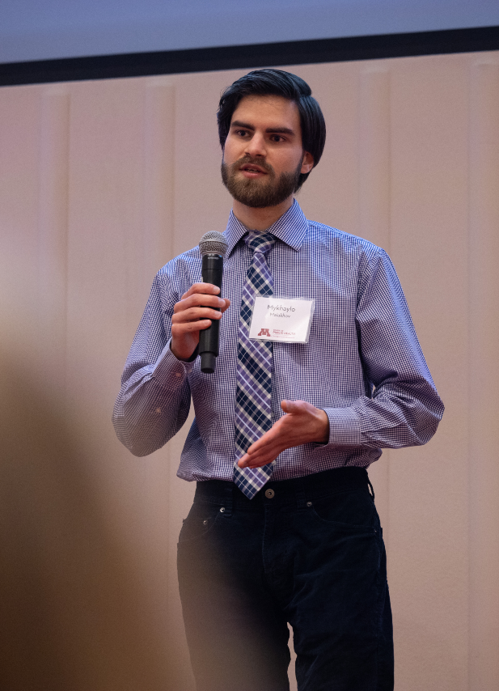

### About me

Currently I am a PhD candidate in the [Division of Biostatistics and Health Data Science](https://www.sph.umn.edu/academics/divisions/biostatistics/) at the [University of Minnesota School of Public Health](https://www.sph.umn.edu/), where I am advised by [Wei Pan](https://www.biostat.umn.edu/~weip/). My research interests are highly interdisciplinary and encompass many facets of genetic epidemiology, statistical genetics, and computational biology. All of my work has both theoretical and practical implications. On one hand, I hope to advance statistical methodology by building new frameworks that can be widely applied to a variety of problems. At the same time, my ultimate goals center around making a tangible, real-world impact. I am particularly excited about leveraging big data and machine learning to uncover the genetic causes and molecular pathways underlying complex diseases. In pursuit of these aims, I am writing my dissertation on statistical methods for integrating genetic information with molecular phenotypes (i.e., omic data).

On this website you can learn more about my [research themes]() and find a list of my [publications](). For more details about my background and experience, keep reading or see my <a href="malakhov_cv.pdf" target="_blank">curriculum vitae</a>.

### A brief history

<<<<<<< Updated upstream
On this website you can learn more about my [research themes]() and find a list of my [publications](). For more details about my background and experience, see my <a href="malakhov_cv.pdf" target="_blank">curriculum vitae</a>.
=======
I am originally from Kyiv, Ukraine but grew up among the mountains and valleys of rural northern California. After graduating from high school at the top of my class, I attended [Andrews University](https://www.andrews.edu/) on a full tuition scholarship. There I discovered the beauty of mathematics and its incredible effectiveness in explaining natural phenomena. Under the mentorship of my professors, I got involved in a research project that used mathematical models to study wildlife populations. This experience inspired me to complete REUs in applied mathematics at [Williams College](https://math.williams.edu/small/) and UCLA's [Institute for Pure and Applied Mathematics](https://www.ipam.ucla.edu/programs/student-research-programs/research-in-industrial-projects-for-students-rips-2019/), and it led to several awards for my work, including the [Goldwater Scholarship](https://goldwaterscholarship.gov/2018-scholars-by-institution-state/).

I quickly realized the importance of data in the biological sciences, so after graduating with a BS in Mathematics I enrolled in the Biostatistics PhD program at the [University of Minnesota, Twin Cities](https://twin-cities.umn.edu/). Here I received a [T32 fellowship](https://sites.google.com/umn.edu/t32-training-grant/) from the National Institutes of Health (NIH), through which I became acquainted with the fascinating world of genetics and molecular biology. During my graduate studies I dived deeply into statistical theory and machine learning, while also exploring the potential ways in which quantitative methods could lead to therapeutic insights. In 2023 I got to experience the practical side of statistical genetics by spending a rewarding summer as an intern at [Denali Therapeutics](https://www.denalitherapeutics.com/). And that brings my story to today!
>>>>>>> Stashed changes

### Russia's invasion of Ukraine

Words cannot describe the destruction and death caused by Russia's invasion of Ukraine. I still have relatives and friends in Ukraine who are enduring the constant missile strikes and giving their all to fight for freedom. If you can, please donate to support Ukraine and its people. I especially recommend and trust the following organizations:

- [Angelia Charity Fund](https://angelia.fund/en-ua) is a nonprofit organization that brings mobile medical clinics and humanitarian aid to de-occupied territories of Ukraine. Many people still live in smaller cities and towns close to the front line, without any medical care and often without basic utilities. The team at Angelia is focused on serving those individuals.
- The [Hospitallers Medical Battalion](https://www.hospitallers.life) is an organization of paramedics who are dedicated to evacuating wounded Ukrainian service members directly from the front lines. They are the medical branch of the Ukrainian Volunteer Army, and they do incredibly brave and selfless work to save as many lives as possible. The Hospitallers are all volunteers and their work is supported entirely by donations.


Слава Україні! :ukraine:


